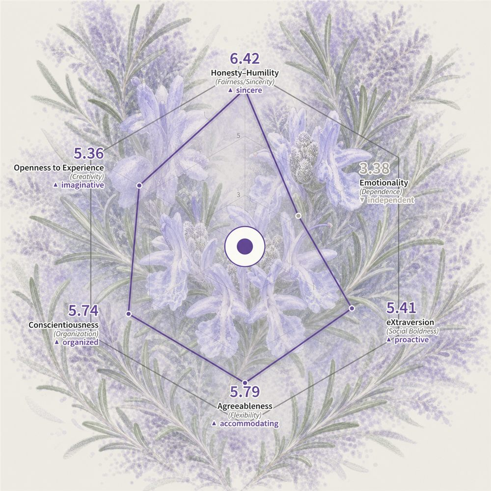

# 식물 성격 이미지 생성기

실제 식물 사진을 업로드하고 여섯 가지 HEXACO 점수를 입력하면 참고 이미지와 같은 스타일의 식물 성격 이미지를 생성하고 2048 × 2048 PNG로 내보내는 데스크톱 브라우저 앱입니다.

## 결과 예시

실제 식물의 투명도를 낮춘 중첩 표현, 주변의 번짐 점묘, HEXACO 6차원 레이더 차트와 영문 성격 라벨이 결합된 결과입니다. 결과 이미지의 영문 용어는 제공된 세 장의 참고 이미지와 동일하게 유지됩니다.

## 사용 방법

1. `앱 실행.bat`을 더블 클릭합니다. 컴퓨터에서만 접근할 수 있는 로컬 서버가 시작되고 기본 브라우저가 열립니다.
2. PNG, JPG 또는 WebP 식물 사진을 업로드합니다.
3. “AI 자동 배경 제거” 또는 “원본 유지”를 선택합니다.
4. 여섯 가지 HEXACO 점수를 입력하고 식물 투명도, 번짐 색상 겹침, 점묘 밀도를 조절합니다.
5. “PNG 생성 및 내보내기”를 클릭합니다.

## 배경 제거 안내

- AI 자동 배경 제거는 브라우저에서 로컬로 실행되며 사진은 서버에 업로드되지 않습니다.
- 처음 사용할 때 약 40 MB의 양자화 모델을 다운로드하며 이후에는 브라우저 캐시를 사용합니다.
- 네트워크 또는 브라우저가 AI 모델을 지원하지 않으면 로컬 윤곽 감지 방식으로 자동 전환됩니다.
- 배경이 복잡한 사진은 AI 자동 배경 제거를 권장하며, 배경을 살리고 싶을 때는 원본 유지를 선택하세요.

## 실행 환경

- 데스크톱 브라우저 전용이며 창 너비 1180 px 이상을 권장합니다.
- 최신 Chrome 또는 Edge를 권장합니다.
- 최초 배경 제거 모델 다운로드를 제외한 모든 이미지 처리와 내보내기는 로컬에서 수행됩니다.

## 파일

- `index.html`: 앱 인터페이스
- `styles.css`: 시각 스타일
- `app.js`: 이미지 처리, 레이더 차트, 내보내기 로직
- `brand-spec.md`: 디자인 시스템 설명
- `THIRD_PARTY.md`: 서드파티 구성 요소 안내

